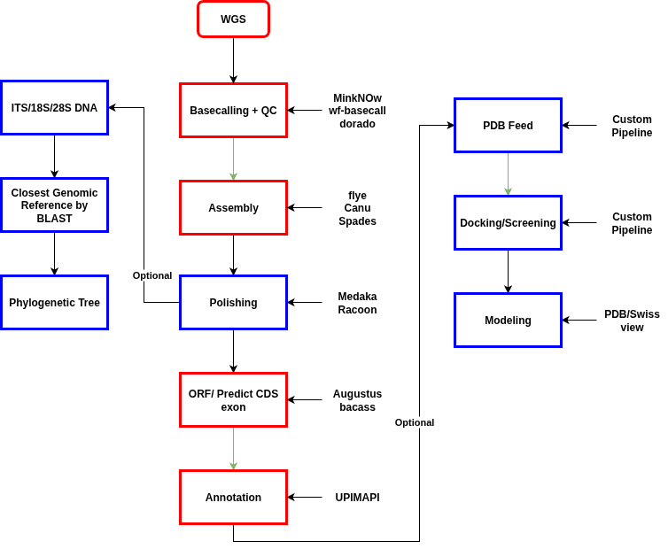

# Eukaryotic-Whole-Genome-Assembly-and-Annotation-Workflow
This repository documents a bioinformatic workflow for the de novo assembly and annotation of a eukaryotic genome with a minimum reference. The workflow utilizes various open-source tools to process Whole Genome Sequencing (WGS) data, perform assembly and polishing, and ultimately annotate the assembled genome.

Workflow Overview
The following steps provide a high-level overview of the entire process.

WGS (Whole Genome Sequencing): Raw sequencing reads are generated.

Basecalling & QC: Raw data is converted into base sequences and quality control is performed to ensure high-quality reads for downstream analysis.

Assembly: Reads are assembled into contigs and scaffolds to reconstruct the genome.

Polishing: The assembled genome is refined to correct sequencing errors and improve accuracy.

ORF/Predict CDS Exon: Open Reading Frames (ORFs) and Coding DNA Sequences (CDS) are predicted to identify protein-coding regions.

Annotation: The final assembled and polished genome is annotated with information about genes, protein functions, and other features.

Tools and Usage
Basecalling and Polishing
The following tools are used for basecalling and polishing, which are critical steps for generating high-quality input for genome assembly.

wf-basecalling (Basecalling)
wf-basecalling is a workflow from EPI2ME Labs designed for efficient and reproducible basecalling of Oxford Nanopore Technologies (ONT) sequencing data.

Installation:
This workflow uses Nextflow to manage compute and software resources. You will need to install Nextflow and either Docker or Singularity.

# Workflow
**Wf-basecalling**
https://github.com/epi2me-labs/wf-basecalling
> wget [https://ont-exd-int-s3-euwst1-epi2me-labs.s3.amazonaws.com/wf-basecalling/wf-basecalling-demo.tar.gz](https://ont-exd-int-s3-euwst1-epi2me-labs.s3.amazonaws.com/wf-basecalling/wf-basecalling-demo.tar.gz)
> tar -xzvf wf-basecalling-demo.tar.gz

Usage:

> nextflow run epi2me-labs/wf-basecalling \
> --input "path/to/fast5/or/pod5/files" \
> --config "path/to/basecalling_config.json" \
> -profile standard

Note: Replace --input with the path to your raw signal files and --config with the appropriate configuration file for your data.

**Medaka **(Polishing)
https://github.com/nanoporetech/medaka
Medaka is a tool to create a consensus sequence from nanopore sequencing data using neural networks. It is highly effective for polishing assemblies, especially those generated by Flye.

Installation:
The simplest way to install Medaka is using conda.

> conda create -n medaka -c conda-forge -c nanoporetech -c bioconda medaka

Usage:

> medaka_consensus -i input_basecalls.fq -d draft_assembly.fa -o output_directory -t <threads>

Note: input_basecalls.fq should be your basecalled FASTQ file, and draft_assembly.fa should be the assembly output from a tool like Flye.

**Flye** (Assembly)
https://github.com/mikolmogorov/Flye
Flye is a de novo assembler for single-molecule sequencing reads.

Installation:

> conda config --add channels defaults
> conda config --add channels bioconda
> conda config --add channels conda-forge
> conda create -n flye_env flye
> conda install -c bioconda flye

Usage:

> flye --nano-hq all_reads_combined.*fastq.gz \
> -o output_directory \
> -g <your_genome_size> \
> -t <threads>

Note: Flye can accept up to 300 fastq files. If you have more, they must be concatenated first.

**Fastcat** (Fastq Concatenation)
https://github.com/epi2me-labs/fastcat
Fastcat is used to concatenate multiple fastq files.

Installation:

> conda install -c conda-forge -c bioconda -c nanoporetech fastcat

Usage:

> fastcat directory_input/*.fastq.gz \
> --hist label_histograms/ \
> output.fastq.gz

**Augustus **(Gene Prediction)
https://github.com/Gaius-Augustus/GUSHR
Augustus is a gene prediction tool.

Installation:

> sudo apt install augustus augustus-data augustus-doc

Usage:

> augustus --species=<species_name> genome.fasta > annotation.gff

Note: To see the full list of available species models, refer to the official Augustus documentation.

**UPIMAPI **(Protein Uniprot Annotation)
https://github.com/iquasere/UPIMAPI
UPIMAPI is used for protein annotation using the Uniprot database.

Installation:

> conda install -c bioconda upimapi

Usage:

> upimapi -i path/to/sequences.fasta -o path/to/output_directory -db database -t threads

Note: The input should be a fasta file containing amino acid sequences.

**ROADIES **(Genome Phylogenetic Analysis)
https://github.com/TurakhiaLab/ROADIES
ROADIES is used for phylogenetic analysis.

Installation:

> conda create -n roadies_env python=3.9 ete3 seaborn
> conda activate roadies_env
> conda install roadies=0.1.10
> cd $CONDA_PREFIX/ROADIES 
> git clone [https://github.com/smirarab/pasta.git](https://github.com/smirarab/pasta.git)
> git clone [https://github.com/smirarab/sate-tools-linux.git](https://github.com/smirarab/sate-tools-linux.git)
> cd pasta
> python3 setup.py develop --user

Usage:

> python run_roadies.py --cores 16

Note: A config.yaml file needs to be set up first. It is recommended to use ribosomal RNA genes (e.g., ITS/18S) for phylogenetic analysis instead of the whole genome.

Other Commands
**rRNA Annotation**:
**barrnap**
https://github.com/tseemann/barrnap
> barrnap --kingdom euk --threads 24 --outseq 'rRNA.fasta' 'assembly.fasta' > 'rRNA.gff'

Convert GFF to Fasta:

> 'getAnnoFasta.pl' --seqfile='seq.fasta' 'seq.gff'

Contributing
If you have suggestions for improvements or alternative tools for this workflow, please feel free to open an issue or submit a pull request.
